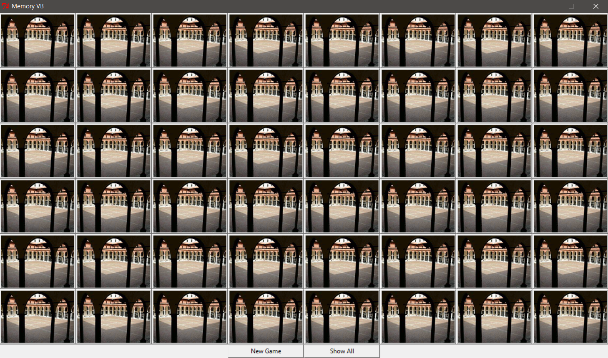
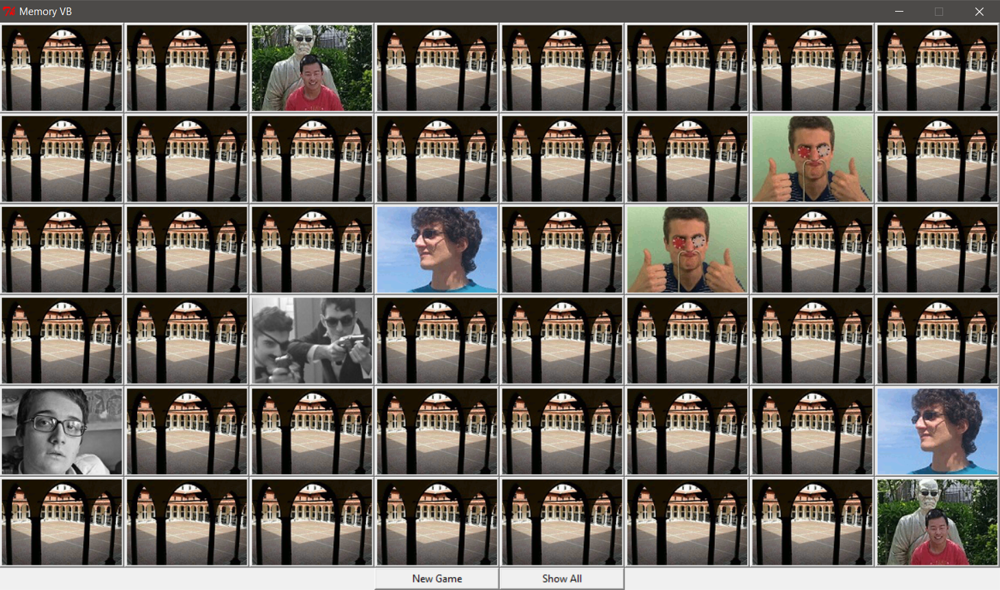

# Memory-VB
A normal Memory game, but with the faces of my highschool friends. Written in Python and Tkinter.

In order to play, download and unzip memoryVB.rar, then run memoryVB.exe.

First created in September 2015.

